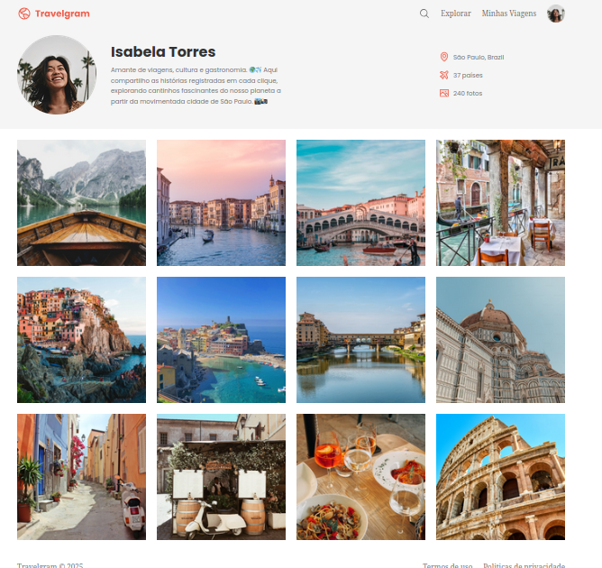

# Travelgram | Perfil de Viagens

Travelgram é um projeto simples de perfil de viagens, desenvolvido em HTML e CSS, utilizando Flexbox para o layout. Este projeto visa criar uma página de perfil de um usuário com imagens de viagens e informações sobre suas aventuras pelo mundo.

## Tecnologias Utilizadas

- **HTML**: Estruturação da página com uso semântico de tags.
- **CSS**: Estilização da página, com uso de Flexbox para layout responsivo.
- **Fontes**: Uso da fonte "Poppins" via Google Fonts para um design limpo e moderno.

## Funcionalidades

- Exibição do perfil de um usuário com informações sobre suas viagens.
- Imagens que ilustram as viagens feitas pelo usuário.
- Navegação simples com links para explorar, visualizar as viagens e acessar o perfil.
- Layout usando Flexbox.

## Layout

O layout é baseado em uma estrutura simples que utiliza Flexbox para alinhar e distribuir os itens de forma fluida, sem a necessidade de outras bibliotecas externas.

### Estrutura da Página

1. **Cabeçalho (Header)**: Contém a imagem do perfil, uma descrição sobre o usuário e informações como localização, número de países visitados e fotos.
2. **Corpo Principal (Main)**: Exibe uma galeria de imagens das viagens realizadas.
3. **Rodapé (Footer)**: Contém informações de copyright e links para os Termos de Uso e Política de Privacidade.

## Como Rodar o Projeto Localmente

1. Clone o repositório para sua máquina local:

    ```bash
    git clone https://github.com/seu-usuario/travelgram.git
    ```

2. Acesse o diretório do projeto:

    ```bash
    cd travelgram
    ```

3. Abra o arquivo `index.html` em seu navegador de preferência.

## Screenshots

Aqui estão algumas imagens do layout do projeto:



## Licença

Este projeto é licenciado sob a Licença MIT - veja o arquivo [LICENSE](LICENSE) para mais detalhes.

---

Se você tiver algum problema ou dúvida, sinta-se à vontade para abrir uma issue!

